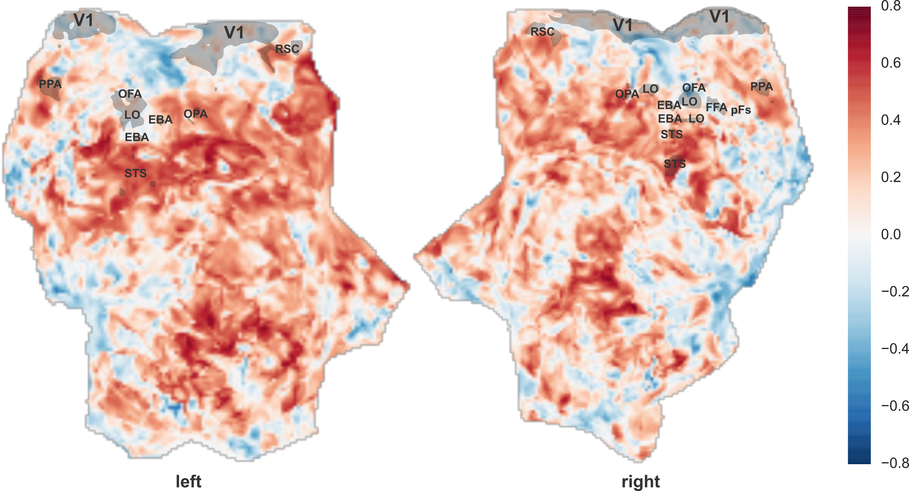
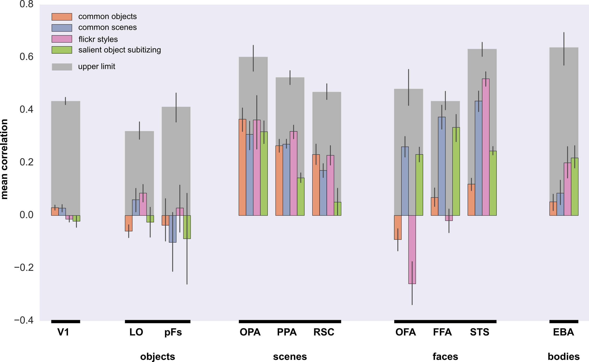
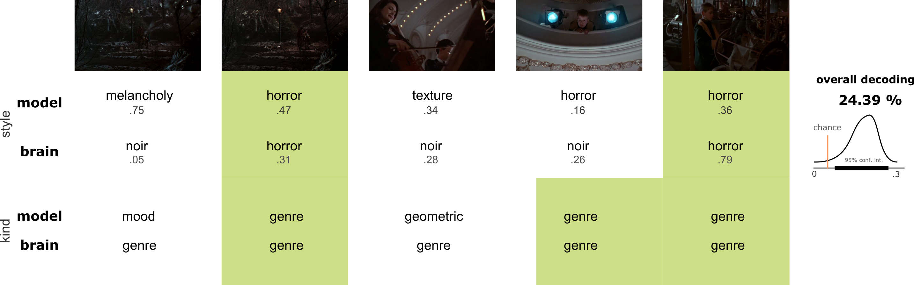
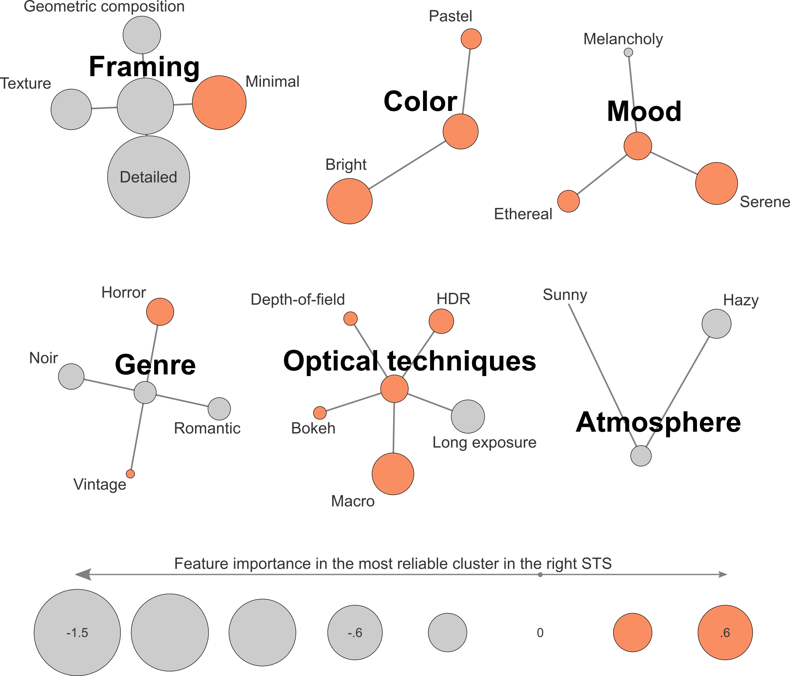

# Encoding Models for the Higher Visual Areas

*Jonas Kubilius and Drew Linsley*

*TAs: Leyla Isik and Alex Kell*

*PI: Nancy Kanwisher*

**NOTE: Below is a report of a project we did at the [CBMM Summer School 2015](http://cbmm.mit.edu/summer-school/2015). Please let us know if you intend to use any of the materials in this repository.**

## Abstract

Humans are able to rapidly perceive and understand their surroundings. However, the visual features used to construct this rich understanding and the regions of cortex tuned to them is undefined. Previous approaches to this question have proven inconsistent, potentially limited by their small data sets measuring neural activity differences along only a few stimulus dimensions at a time. Here we adopted a dramatically different approach, using a dynamic stimulus and Deep Neural Networks as a data-driven approach to rapid prototyping of multiple encoding models for measuring tuning of high-level visual features in cortex.

## Introduction

Humans are able to gather a rich description of their surroundings through a single glance. For instance, driving through downtown Boston may require an individual to not only accurately perceive the types of objects around them, but also to quickly estimate the intentions of pedestrians and other drivers. While great steps have been taken to untangle the mechanisms underlying object perception, investigations into high-level visual understanding have yielded inconsistent results.

A potential reason for this lack of success is the typically limited "stimulus-referred" approach to measuring the human visual system, in which brain activity is measured in response to a set of visual stimuli that vary along relatively few feature dimensions. However, this approach may be unfit for studying high-level visual understanding, which spans a large feature space and is tightly linked to the task at hand.

An alternative approach to studying high-level visual understanding has recently emerged, in which dynamic stimuli (i.e. videos) are used to interrogate responses in visual areas. These stimuli typically depict dynamic interactions in the real-world, enabling researchers to jointly test a variety of hypotheses about neural tuning provided appropriate post-hoc labeling of the stimuli ([Çukur et al., 2013][ccukur2013attention]). In the current study we adopted this approach to characterize high level visual processing across human cortex.

In contrast to typical neuroimaging experiments in which subjects view static and tightly controlled stimuli, the subject in this experiment viewed *Home Alone 2*. In order to understand how brain activity related to the action on the screen, we adopted an encoding model approach that has performed well under similar circumstances. In this approach, linear models are fit to each voxel’s timecourse to estimate the relationship between the voxel’s activity and a stimuli features. Key to this type of supervised approach is an overcomplete set of annotations describing the action on screen. Rather than hand-label stimuli, we utilized convolutional neural networks (CNN) to automatically produce annotations for each scene across multiple visual dimensions. To anticipate, we demonstrate that multiple regions of the ventral visual system are tuned to various high-level visual features, and that CNNs are a powerful tool for building voxel-wise encoding models.

## Materials and Methods

### Data collection

Data was collected by the Center for Brains, Minds, and Machines Summer Course teaching assistants, Leyla Isik and Alex Kell. One male subject viewed sections of the movie *Home Alone 2* while being scanned with a magnetic resonance imaging (MRI) scanner. Initially, the subject was scanned twice over two days while watching the full movie. However, technical issues prompted the subject to complete an addition four scanning sessions during which the subject watched the same excerpt lasting approximately 20 minutes. All analyses were performed on these four scanning sessions. The participant passively watched the movie during each session and did not complete any task.

**Figure 1.** *Visual Style encoding model prediction. A visual style encoding model was created by encoding the movie's visual style and fitting it to each voxel's activity. Correlations between held-out activity and predicted activity for those same voxels were calculated and projected to a flattened map of each hemisphere of the participant. Warmer colors depict areas with stronger correlations between their actual and predicted activity. Gray patches and their labels depict ROIs used in our analyses.*

In a separate session, a comprehensive localizer was used to identify regions-of-interest (ROIs), used in further analyses (see Fig. [1](#preds-rois)):

- Primary visual cortex (V1).
- Object-selective posterior and anterior parts of lateral occipital cortex (LO and pFs).
- Scene-selective areas occipital place area (OPA), parahippocampal place area (PPA), and retrosplenial cortex (RSC).
- Face-selective areas occipital face area (OFA) and fusiform face area (FFA).
- Social cognition-oriented superior temporal sulcus (STS).
- Body-selective area extrastriate body area (EBA).

### fMRI preprocessing

Brain volumes gathered during scanning were preprocessed with FSFAST to remove motion artifacts and transformed to a flattened cortical surface. These volumes were then passed through MATLAB scripts that detrended and normalized each to 0 mean and unit variance. Voxel timecourses were shifted 4 seconds (2 TRs) back in time to correct for hemodynamic response lag. This was done by removing the first two TRs of each voxel timecourse then adding two TRs of mean signal to the end. These procedures were performed separately for each voxel within each scan run.

### Convolutional neural networks

CNNs have been successfully applied in a variety of computer vision approaches, identifying objects, places, and other features of real-world images with accuracy that at times approaches human performance ([Krizhevsky et al., 2012][krizhevsky2012imagenet], [Szegedy et al., 2014][szegedy2014going]). Thus, we reasoned that movie annotations produced by these models could provide reasonable matches to human perception.

In order to capture as much perceptual variability in the movie as possible, we used four CNNs that were pretrained to identify non-overlapping visual features. All four CNNs were based on the common AlexNet architecture, provided by the Caffe library ([Jia et al., 2014][jia2014caffe]) that consists of five convolutional layers and three fully-connected layers, but were trained to perform different tasks:

- **Objects**, trained to identify 978 objects from the ImageNet as a part of the Hybdrid-CNN ([Zhou et al., 2014][zhou2014learning]). To reduce dimensionality and obtain more robust encoding model fits on our limited fMRI dataset, we reduced feature space to 25 high-level categories ([ImageNet Stats](http://image-net.org/about-stats)).

- **Places**, trained to identify 205 scene categories from the Places205 Database ([Zhou et al., 2014][zhou2014learning]). The feature space was reduced to 21 semantically similar clusters using Word2Vec ([Mikolov et al., 2013][mikolov2013efficient]) with the [*text8* word corpus](http://mattmahoney.net/dc/text8.zip). This dimensionality reduction was performed to improve the quality of voxel encoding models.

- **Visual Style**, trained to identify the style of [images on Flickr](https://gist.github.com/sergeyk/034c6ac3865563b69e60), such as geometric patterns or vintage. There were 20 styles in total, that were further grouped into 6 broader categories (framing, color, mood, genre, optical techniques, and atmosphere). We used the 20 features in and not these 6 grouped features in building enconding models.

- **Object Count**, trained to count the number of salient objects in an image ([Zhang et al., 2015][zhang2015salient]). Counts produced by this model were zero, one, two, three, or four or greater.

These models were used to annotate each frame of *Home Alone 2*. Next, we used these annotations to provide feature descriptors of each datapoint in our fMRI data.

In order to align these annotations, which were sampled at 23.98 frames per second, with the fMRI data that was sampled at every 2 seconds (i.e., once per TR), only the annotation corresponding to the frame presented 1 second after the onset of a TR was kept. The resulting feature matrices were used to construct encoding models for each voxel. These matrices were standardized to zero mean and unit variance in order to yield standardized weights when fitting encoding models.

### Encoding models

Using the annotated dataset, we built an L2-regularized linear regression model between image features (produced by a CNN) and voxel activity (code for our analyses is available at [GitHub](https://github.com/drewlinsley/ha_fmri)). The resultant set of weights form an "encoding model" that estimates the relationship between neural data and CNN features. Encoding models were constructed from the first 481 timepoints of voxel activity and movie annotations. These timepoints constituted a ''training'' set of data, that was analyzed in isolation from other data. In order to reduce carry-over effects from the training set, the final 3 timepoints were excluded from analysis. In a ten-fold cross-validation procedure, we selected the optimal regularization parameter that yielded the best model fit. Regularization parameters were chosen from 0.01 to 10 in steps through log space. The optimal regularization parameter was used to obtain the weights for each model.

Following construction of encoding models on the training data, these models were tested against the remaining 50 timepoints of data, which constituted the "testing" set. Each encoding model was fed with annotations from the testing set to produce a predicted, "synthetic timecourse" of the voxel activity it expected during that part of the movie. We correlated each voxel's synthetic timecourse with its actual time course to evaluate model fit.

## Results and Discussion

Fig. [1](#preds-rois) depicts correlations between model-generated and fMRI data for the Visual Style, projected to a flattened map of each hemisphere of the participant. Many of the higher visual areas appear to be predicted well by the movie's visual style. To gain more insight into model predictability, we averaged correlations in each ROI for each model (Fig. [2](#preds)).

**Figure 2.** *Model correlations with ROIs. Gray bars indicate the upper limit of correlations that was obtained by Spearman-Brown-corrected split-half correlations of the actual fMRI data. Error bars depict 95% bootstrapped confidence intervals.*

Most models appeared to account well for scene-selective areas, but no model could reliably capture activity in V1, EBA, and object-selective regions. Since higher-level features are captured by all of these models, the lack of correlation with V1 is not surprising. We expect that models capturing low-level visual statistics would provide a better fit (e.g. HMAX or gist).

Similarly, body parts were not explicitly encoded in any of our models, thus explaining the lack of robust correlations in EBA. Poor performance on object-selective areas also indicates that the reduced feature set that we used is not a good model for object-selective areas.

Somewhat more surprisingly, Places and Object Count models captured a large portion of face-related area activities, nearly reaching the theoretical limit in the case of FFA. One possibility for such good performance of the Places model is that faces could have been correlated with specific types of scenes in the movie (e.g., faces might have mostly appears in indoor scenes). Similarly, Object Count model might have captured the fact that a typical frame with a face in it contains a single object (the face) or two smaller objects (the eyes).

Overall, the best performing model was the Visual Style model that reached over .5 correlation with STS activity. For further analyses, we decided to focus on this ROI to gain a better understanding what features it might encode.

### Decoding
We adopted a multivoxel approach to decode the movie's visual style using activity in STS. Given the failure of previous studies of STS to provide a consistent characterization of its visual feature tuning, we reasoned that it consisted of several subregions with different response properties. Using affinity propagation clustering, we identified clusters of voxels within STS with unique tuning properties. Affinity propagation determines the set of clusters that optimally "passes messages" through a network consisting of all datapoints. This algorithm indicated that STS contains 3 clusters of voxels with different relationships to each encoding model. For the decoding analysis, we focused on the STS cluster that was best fit to the visual style of the movie, located within right STS.

We used a softmax classifier to decode the visual style of each movie frame in the testing set of data. The classifier was 5-fold cross-validated on the testing set, first being fit on 80% of the data and then tested on a held-out 20% of the data. A regularization parameter was additionally 5-fold cross-validated on the classifier fit data using the same approach as detailed above for encoding models. Overall, our model achieved 24.39% decoding accuracy, which was well above chance as indicated by the 95% bootstrapped confidence interval  (Fig. [3](#decoding)).

**Figure 3.** *Comparison of model and brain decoding of the visual style and the kind of style for several random movie frames. Green indicates where the predictions match. The cartoon plot on the left shows overall model decoding and the 95% bootstrapped confidence interval.*

### ROI tuning properties

Finally, we computed how well the visual style feature encoding model fit this cluster of voxels in STS. We did this by visualizing the averaged encoding model weights across this cluster for each of the visual style features (Fig. [4](#tuning)). These features were further grouped into their basic level clusters to gain broader insight into the types of high-level visual features to which this cluster was tuned. A direct comparison of the magnitudes of these weights was possible since they were standardized. We found that color, mood, and optical techniques were most important in predicting the activity of this cluster, whereas framing, genre, and atmosphere did not predict cluster's activity well.

**Figre 4.** *Tuning properties in a voxel cluster in the right STS.*

## Conclusion

Overall, we demonstrated a novel, data-driven approach to investigate encoding properties in the cortex by leveraging deep neural networks.

## Acknowledgements

We thank our TAs Leyla Isik and Alex Kell for their help on this project, and Nancy Kanwisher for discussions.

[zhou2014learning]: http://papers.nips.cc/paper/5349-learning-deep-features-for-scene-recognition-using-places-database
[mikolov2013efficient]: http://arxiv.org/abs/1301.3781
[krizhevsky2012imagenet]: http://papers.nips.cc/paper/4824-imagenet-classification-w
[szegedy2014going]: http://arxiv.org/abs/1409.4842
[jia2014caffe]: http://arxiv.org/abs/1408.5093
[zhang2015salient]: http://www.cv-foundation.org/openaccess/content_cvpr_2015/app/2B_077.pdf
[yamins2014performance]: http://doi.org/10.1073/pnas.1403112111
[ccukur2013attention]: http://doi.org/10.1038/nn.3381
